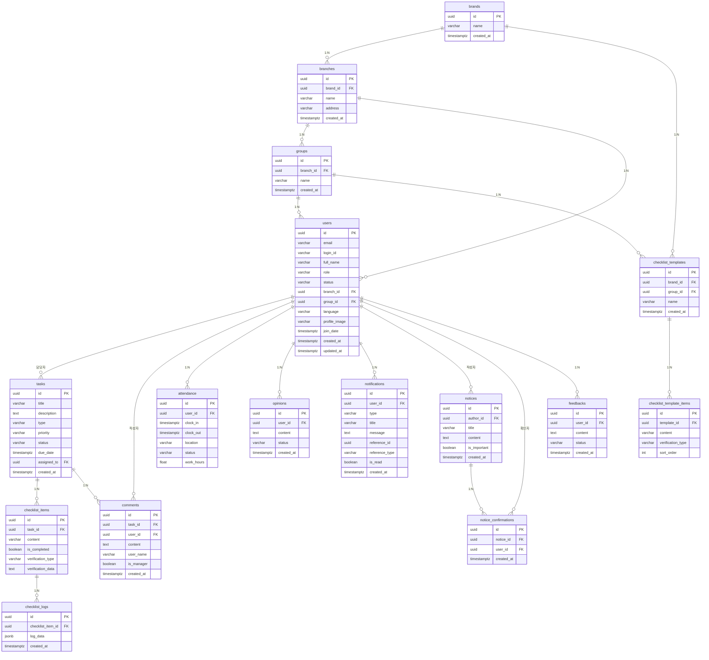

# Task Server DB 명세서

> Supabase (PostgreSQL) 기반 업무 관리 시스템 데이터베이스 스키마 명세

**작성일**: 2026-02-13
**데이터베이스**: Supabase (PostgreSQL)
**테이블 수**: 16개

---

## 목차

1. [개요](#1-개요)
2. [ER 다이어그램](#2-er-다이어그램)
3. [도메인별 테이블 명세](#3-도메인별-테이블-명세)
   - [3.1 조직 도메인](#31-조직-도메인-organization)
   - [3.2 사용자 도메인](#32-사용자-도메인-user)
   - [3.3 업무 도메인](#33-업무-도메인-task)
   - [3.4 체크리스트 도메인](#34-체크리스트-도메인-checklist)
   - [3.5 운영 도메인](#35-운영-도메인-operations)
4. [Enum 정의](#4-enum-정의)
5. [테이블 관계 요약](#5-테이블-관계-요약)

---

## 1. 개요

Task Server는 프랜차이즈/매장 운영을 위한 업무 관리 시스템입니다.
조직(브랜드 > 지점 > 그룹) 구조 하에 직원 관리, 업무 할당, 체크리스트, 출퇴근, 공지사항, 건의사항 등의 기능을 제공합니다.

### 도메인 구성

| 도메인 | 테이블 수 | 설명 |
|--------|-----------|------|
| 조직 (Organization) | 3 | brands, branches, groups |
| 사용자 (User) | 1 | users |
| 업무 (Task) | 2 | tasks, comments |
| 체크리스트 (Checklist) | 4 | checklist_items, checklist_logs, checklist_templates, checklist_template_items |
| 운영 (Operations) | 6 | attendance, opinions, notifications, notices, notice_confirmations, feedbacks |

---

## 2. ER 다이어그램



---

## 3. 도메인별 테이블 명세

### 3.1 조직 도메인 (Organization)

#### 3.1.1 `brands` - 브랜드

> 프랜차이즈 브랜드(최상위 조직 단위)

| 컬럼명 | 타입 | NULL 허용 | 기본값 | 설명 |
|---------|------|:---------:|--------|------|
| `id` | `uuid` | NO | `gen_random_uuid()` | 브랜드 고유 ID (PK) |
| `name` | `varchar` | NO | - | 브랜드명 |
| `created_at` | `timestamptz` | NO | `now()` | 생성일시 |

**제약조건**:
- PK: `id`
- UNIQUE: `name` (브랜드명 중복 불가)

---

#### 3.1.2 `branches` - 지점

> 브랜드 소속 지점(매장)

| 컬럼명 | 타입 | NULL 허용 | 기본값 | 설명 |
|---------|------|:---------:|--------|------|
| `id` | `uuid` | NO | `gen_random_uuid()` | 지점 고유 ID (PK) |
| `brand_id` | `uuid` | NO | - | 소속 브랜드 ID (FK → brands.id) |
| `name` | `varchar` | NO | - | 지점명 |
| `address` | `varchar` | YES | `NULL` | 지점 주소 |
| `created_at` | `timestamptz` | NO | `now()` | 생성일시 |

**제약조건**:
- PK: `id`
- FK: `brand_id` → `brands(id)` ON DELETE CASCADE

**인덱스**:
- `idx_branches_brand_id` ON `brand_id`

---

#### 3.1.3 `groups` - 그룹

> 지점 내 직원 그룹(파트, 팀 등)

| 컬럼명 | 타입 | NULL 허용 | 기본값 | 설명 |
|---------|------|:---------:|--------|------|
| `id` | `uuid` | NO | `gen_random_uuid()` | 그룹 고유 ID (PK) |
| `branch_id` | `uuid` | NO | - | 소속 지점 ID (FK → branches.id) |
| `name` | `varchar` | NO | - | 그룹명 |
| `created_at` | `timestamptz` | NO | `now()` | 생성일시 |

**제약조건**:
- PK: `id`
- FK: `branch_id` → `branches(id)` ON DELETE CASCADE

**인덱스**:
- `idx_groups_branch_id` ON `branch_id`

---

### 3.2 사용자 도메인 (User)

#### 3.2.1 `users` - 사용자 프로필

> Supabase `auth.users`와 연동되는 사용자 프로필 정보

| 컬럼명 | 타입 | NULL 허용 | 기본값 | 설명 |
|---------|------|:---------:|--------|------|
| `id` | `uuid` | NO | - | 사용자 ID (PK, auth.users.id와 동일) |
| `email` | `varchar` | NO | - | 이메일 주소 |
| `login_id` | `varchar` | NO | - | 로그인 ID |
| `full_name` | `varchar` | NO | - | 사용자 이름 |
| `role` | `varchar` | NO | `'staff'` | 역할 (staff/manager/admin) |
| `status` | `varchar` | NO | `'pending'` | 계정 상태 (pending/active/inactive) |
| `branch_id` | `uuid` | YES | `NULL` | 소속 지점 ID (FK → branches.id) |
| `group_id` | `uuid` | YES | `NULL` | 소속 그룹 ID (FK → groups.id) |
| `language` | `varchar` | NO | `'ko'` | 언어 설정 |
| `profile_image` | `varchar` | YES | `NULL` | 프로필 이미지 URL |
| `join_date` | `timestamptz` | YES | `NULL` | 입사일 |
| `created_at` | `timestamptz` | NO | `now()` | 생성일시 |
| `updated_at` | `timestamptz` | NO | `now()` | 수정일시 |

**제약조건**:
- PK: `id`
- FK: `branch_id` → `branches(id)` ON DELETE SET NULL
- FK: `group_id` → `groups(id)` ON DELETE SET NULL
- FK: `id` → `auth.users(id)` ON DELETE CASCADE
- UNIQUE: `email`
- UNIQUE: `login_id`
- CHECK: `role` IN ('staff', 'manager', 'admin')
- CHECK: `status` IN ('pending', 'active', 'inactive')

**인덱스**:
- `idx_users_branch_id` ON `branch_id`
- `idx_users_group_id` ON `group_id`
- `idx_users_role` ON `role`
- `idx_users_status` ON `status`

**Enum 값**:

| 필드 | 값 | 설명 |
|------|-----|------|
| `role` | `staff` | 일반 직원 |
| `role` | `manager` | 매니저 |
| `role` | `admin` | 관리자 |
| `status` | `pending` | 승인 대기 |
| `status` | `active` | 활성 |
| `status` | `inactive` | 비활성 |

---

### 3.3 업무 도메인 (Task)

#### 3.3.1 `tasks` - 업무

> 데일리 루틴 및 할당 업무 관리

| 컬럼명 | 타입 | NULL 허용 | 기본값 | 설명 |
|---------|------|:---------:|--------|------|
| `id` | `uuid` | NO | `gen_random_uuid()` | 업무 고유 ID (PK) |
| `title` | `varchar` | NO | - | 업무 제목 |
| `description` | `text` | YES | `NULL` | 업무 상세 설명 |
| `type` | `varchar` | NO | - | 업무 유형 (daily/assigned) |
| `priority` | `varchar` | NO | `'normal'` | 우선순위 (urgent/normal/low) |
| `status` | `varchar` | NO | `'todo'` | 진행 상태 (todo/in_progress/done) |
| `due_date` | `timestamptz` | YES | `NULL` | 마감 기한 |
| `assigned_to` | `uuid` | YES | `NULL` | 담당자 ID (FK → users.id) |
| `created_at` | `timestamptz` | NO | `now()` | 생성일시 |

**제약조건**:
- PK: `id`
- FK: `assigned_to` → `users(id)` ON DELETE SET NULL
- CHECK: `type` IN ('daily', 'assigned')
- CHECK: `priority` IN ('urgent', 'normal', 'low')
- CHECK: `status` IN ('todo', 'in_progress', 'done')

**인덱스**:
- `idx_tasks_assigned_to` ON `assigned_to`
- `idx_tasks_type` ON `type`
- `idx_tasks_status` ON `status`
- `idx_tasks_due_date` ON `due_date`

**Enum 값**:

| 필드 | 값 | 설명 |
|------|-----|------|
| `type` | `daily` | 데일리 루틴 업무 |
| `type` | `assigned` | 할당된 업무 |
| `priority` | `urgent` | 긴급 |
| `priority` | `normal` | 보통 |
| `priority` | `low` | 낮음 |
| `status` | `todo` | 할 일 |
| `status` | `in_progress` | 진행 중 |
| `status` | `done` | 완료 |

---

#### 3.3.2 `comments` - 댓글

> 업무에 대한 댓글/피드백

| 컬럼명 | 타입 | NULL 허용 | 기본값 | 설명 |
|---------|------|:---------:|--------|------|
| `id` | `uuid` | NO | `gen_random_uuid()` | 댓글 고유 ID (PK) |
| `task_id` | `uuid` | NO | - | 업무 ID (FK → tasks.id) |
| `user_id` | `uuid` | NO | - | 작성자 ID (FK → users.id) |
| `content` | `text` | NO | - | 댓글 내용 |
| `user_name` | `varchar` | YES | `NULL` | 작성자 이름 (비정규화) |
| `is_manager` | `boolean` | NO | `false` | 관리자 여부 |
| `created_at` | `timestamptz` | NO | `now()` | 생성일시 |

**제약조건**:
- PK: `id`
- FK: `task_id` → `tasks(id)` ON DELETE CASCADE
- FK: `user_id` → `users(id)` ON DELETE CASCADE

**인덱스**:
- `idx_comments_task_id` ON `task_id`
- `idx_comments_created_at` ON `created_at`

---

### 3.4 체크리스트 도메인 (Checklist)

#### 3.4.1 `checklist_items` - 체크리스트 항목

> 업무에 연결된 체크리스트 항목

| 컬럼명 | 타입 | NULL 허용 | 기본값 | 설명 |
|---------|------|:---------:|--------|------|
| `id` | `uuid` | NO | `gen_random_uuid()` | 항목 고유 ID (PK) |
| `task_id` | `uuid` | NO | - | 업무 ID (FK → tasks.id) |
| `content` | `varchar` | NO | - | 체크리스트 내용 |
| `is_completed` | `boolean` | NO | `false` | 완료 여부 |
| `verification_type` | `varchar` | NO | `'none'` | 검증 유형 (none/photo/signature) |
| `verification_data` | `text` | YES | `NULL` | 검증 데이터 (사진 URL, 서명 등) |

**제약조건**:
- PK: `id`
- FK: `task_id` → `tasks(id)` ON DELETE CASCADE
- CHECK: `verification_type` IN ('none', 'photo', 'signature')

**인덱스**:
- `idx_checklist_items_task_id` ON `task_id`

---

#### 3.4.2 `checklist_logs` - 체크리스트 이력

> 체크리스트 항목의 검증/완료 이력 로그

| 컬럼명 | 타입 | NULL 허용 | 기본값 | 설명 |
|---------|------|:---------:|--------|------|
| `id` | `uuid` | NO | `gen_random_uuid()` | 로그 고유 ID (PK) |
| `checklist_item_id` | `uuid` | NO | - | 체크리스트 항목 ID (FK → checklist_items.id) |
| `log_data` | `jsonb` | YES | `NULL` | 로그 데이터 (JSON) |
| `created_at` | `timestamptz` | NO | `now()` | 생성일시 |

**제약조건**:
- PK: `id`
- FK: `checklist_item_id` → `checklist_items(id)` ON DELETE CASCADE

**인덱스**:
- `idx_checklist_logs_item_id` ON `checklist_item_id`

---

#### 3.4.3 `checklist_templates` - 체크리스트 템플릿

> 브랜드/그룹별 재사용 가능한 체크리스트 템플릿

| 컬럼명 | 타입 | NULL 허용 | 기본값 | 설명 |
|---------|------|:---------:|--------|------|
| `id` | `uuid` | NO | `gen_random_uuid()` | 템플릿 고유 ID (PK) |
| `brand_id` | `uuid` | YES | `NULL` | 브랜드 ID (FK → brands.id) |
| `group_id` | `uuid` | YES | `NULL` | 그룹 ID (FK → groups.id) |
| `name` | `varchar` | NO | - | 템플릿명 |
| `created_at` | `timestamptz` | NO | `now()` | 생성일시 |

**제약조건**:
- PK: `id`
- FK: `brand_id` → `brands(id)` ON DELETE SET NULL
- FK: `group_id` → `groups(id)` ON DELETE SET NULL

**인덱스**:
- `idx_checklist_templates_brand_id` ON `brand_id`
- `idx_checklist_templates_group_id` ON `group_id`

---

#### 3.4.4 `checklist_template_items` - 템플릿 항목

> 체크리스트 템플릿의 개별 항목

| 컬럼명 | 타입 | NULL 허용 | 기본값 | 설명 |
|---------|------|:---------:|--------|------|
| `id` | `uuid` | NO | `gen_random_uuid()` | 항목 고유 ID (PK) |
| `template_id` | `uuid` | NO | - | 템플릿 ID (FK → checklist_templates.id) |
| `content` | `varchar` | NO | - | 항목 내용 |
| `verification_type` | `varchar` | NO | `'none'` | 검증 유형 |
| `sort_order` | `integer` | NO | `0` | 정렬 순서 |

**제약조건**:
- PK: `id`
- FK: `template_id` → `checklist_templates(id)` ON DELETE CASCADE

**인덱스**:
- `idx_template_items_template_id` ON `template_id`

---

### 3.5 운영 도메인 (Operations)

#### 3.5.1 `attendance` - 출퇴근 기록

> 직원 출퇴근 및 근무시간 기록

| 컬럼명 | 타입 | NULL 허용 | 기본값 | 설명 |
|---------|------|:---------:|--------|------|
| `id` | `uuid` | NO | `gen_random_uuid()` | 기록 고유 ID (PK) |
| `user_id` | `uuid` | NO | - | 사용자 ID (FK → users.id) |
| `clock_in` | `timestamptz` | NO | - | 출근 시각 |
| `clock_out` | `timestamptz` | YES | `NULL` | 퇴근 시각 |
| `location` | `varchar` | YES | `NULL` | 출근 위치 정보 |
| `status` | `varchar` | NO | `'not_started'` | 출퇴근 상태 |
| `work_hours` | `float` | YES | `NULL` | 근무 시간 (시간 단위) |

**제약조건**:
- PK: `id`
- FK: `user_id` → `users(id)` ON DELETE CASCADE
- CHECK: `status` IN ('not_started', 'on_duty', 'off_duty', 'completed')

**인덱스**:
- `idx_attendance_user_id` ON `user_id`
- `idx_attendance_clock_in` ON `clock_in`
- `idx_attendance_user_date` ON `(user_id, clock_in)` -- 복합 인덱스

**Enum 값**:

| 값 | 설명 |
|-----|------|
| `not_started` | 미출근 |
| `on_duty` | 근무 중 |
| `off_duty` | 퇴근 |
| `completed` | 근무 완료 |

---

#### 3.5.2 `opinions` - 건의사항

> 직원이 제출하는 건의사항/의견

| 컬럼명 | 타입 | NULL 허용 | 기본값 | 설명 |
|---------|------|:---------:|--------|------|
| `id` | `uuid` | NO | `gen_random_uuid()` | 건의 고유 ID (PK) |
| `user_id` | `uuid` | NO | - | 작성자 ID (FK → users.id) |
| `content` | `text` | NO | - | 건의 내용 |
| `status` | `varchar` | NO | `'submitted'` | 처리 상태 |
| `created_at` | `timestamptz` | NO | `now()` | 생성일시 |

**제약조건**:
- PK: `id`
- FK: `user_id` → `users(id)` ON DELETE CASCADE
- CHECK: `status` IN ('submitted', 'reviewed', 'resolved')

**인덱스**:
- `idx_opinions_user_id` ON `user_id`
- `idx_opinions_status` ON `status`
- `idx_opinions_created_at` ON `created_at`

**Enum 값**:

| 값 | 설명 |
|-----|------|
| `submitted` | 제출됨 |
| `reviewed` | 검토됨 |
| `resolved` | 해결됨 |

---

#### 3.5.3 `notifications` - 알림

> 사용자별 알림 메시지

| 컬럼명 | 타입 | NULL 허용 | 기본값 | 설명 |
|---------|------|:---------:|--------|------|
| `id` | `uuid` | NO | `gen_random_uuid()` | 알림 고유 ID (PK) |
| `user_id` | `uuid` | NO | - | 수신자 ID (FK → users.id) |
| `type` | `varchar` | NO | - | 알림 유형 |
| `title` | `varchar` | NO | - | 알림 제목 |
| `message` | `text` | NO | - | 알림 내용 |
| `reference_id` | `uuid` | YES | `NULL` | 참조 대상 ID (업무, 공지 등) |
| `reference_type` | `varchar` | YES | `NULL` | 참조 대상 유형 (task, notice 등) |
| `is_read` | `boolean` | NO | `false` | 읽음 여부 |
| `created_at` | `timestamptz` | NO | `now()` | 생성일시 |

**제약조건**:
- PK: `id`
- FK: `user_id` → `users(id)` ON DELETE CASCADE
- CHECK: `type` IN ('task_assigned', 'task_updated', 'notice', 'feedback', 'system')

**인덱스**:
- `idx_notifications_user_id` ON `user_id`
- `idx_notifications_is_read` ON `(user_id, is_read)` -- 복합 인덱스
- `idx_notifications_created_at` ON `created_at`

**Enum 값**:

| 값 | 설명 |
|-----|------|
| `task_assigned` | 업무 할당 알림 |
| `task_updated` | 업무 변경 알림 |
| `notice` | 공지사항 알림 |
| `feedback` | 피드백 알림 |
| `system` | 시스템 알림 |

---

#### 3.5.4 `notices` - 공지사항

> 관리자가 작성하는 공지사항

| 컬럼명 | 타입 | NULL 허용 | 기본값 | 설명 |
|---------|------|:---------:|--------|------|
| `id` | `uuid` | NO | `gen_random_uuid()` | 공지 고유 ID (PK) |
| `author_id` | `uuid` | YES | `NULL` | 작성자 ID (FK → users.id) |
| `title` | `varchar` | NO | - | 공지 제목 |
| `content` | `text` | NO | - | 공지 본문 |
| `is_important` | `boolean` | NO | `false` | 중요 공지 여부 |
| `created_at` | `timestamptz` | NO | `now()` | 생성일시 |

**제약조건**:
- PK: `id`
- FK: `author_id` → `users(id)` ON DELETE SET NULL

**인덱스**:
- `idx_notices_created_at` ON `created_at`
- `idx_notices_is_important` ON `is_important`

---

#### 3.5.5 `notice_confirmations` - 공지 확인

> 공지사항 읽음 확인 기록

| 컬럼명 | 타입 | NULL 허용 | 기본값 | 설명 |
|---------|------|:---------:|--------|------|
| `id` | `uuid` | NO | `gen_random_uuid()` | 확인 고유 ID (PK) |
| `notice_id` | `uuid` | NO | - | 공지 ID (FK → notices.id) |
| `user_id` | `uuid` | NO | - | 확인자 ID (FK → users.id) |
| `created_at` | `timestamptz` | NO | `now()` | 확인일시 |

**제약조건**:
- PK: `id`
- FK: `notice_id` → `notices(id)` ON DELETE CASCADE
- FK: `user_id` → `users(id)` ON DELETE CASCADE
- UNIQUE: `(notice_id, user_id)` -- 중복 확인 방지

**인덱스**:
- `idx_notice_confirmations_notice_id` ON `notice_id`
- `idx_notice_confirmations_user_id` ON `user_id`

---

#### 3.5.6 `feedbacks` - 피드백

> 업무/성과에 대한 피드백 기록

| 컬럼명 | 타입 | NULL 허용 | 기본값 | 설명 |
|---------|------|:---------:|--------|------|
| `id` | `uuid` | NO | `gen_random_uuid()` | 피드백 고유 ID (PK) |
| `user_id` | `uuid` | YES | `NULL` | 대상 사용자 ID (FK → users.id) |
| `content` | `text` | NO | - | 피드백 내용 |
| `status` | `varchar` | YES | `NULL` | 피드백 상태 |
| `created_at` | `timestamptz` | NO | `now()` | 생성일시 |

**제약조건**:
- PK: `id`
- FK: `user_id` → `users(id)` ON DELETE SET NULL

**인덱스**:
- `idx_feedbacks_user_id` ON `user_id`

---

## 4. Enum 정의

### 4.1 TaskType (업무 유형)
```
daily    - 데일리 루틴 업무
assigned - 할당된 업무
```

### 4.2 Priority (우선순위)
```
urgent - 긴급
normal - 보통
low    - 낮음
```

### 4.3 TaskStatus (업무 상태)
```
todo        - 할 일
in_progress - 진행 중
done        - 완료
```

### 4.4 UserRole (사용자 역할)
```
staff   - 일반 직원
manager - 매니저
admin   - 관리자
```

### 4.5 UserStatus (계정 상태)
```
pending  - 승인 대기
active   - 활성
inactive - 비활성
```

### 4.6 AttendanceStatus (출퇴근 상태)
```
not_started - 미출근
on_duty     - 근무 중
off_duty    - 퇴근
completed   - 근무 완료
```

### 4.7 NotificationType (알림 유형)
```
task_assigned - 업무 할당 알림
task_updated  - 업무 변경 알림
notice        - 공지사항 알림
feedback      - 피드백 알림
system        - 시스템 알림
```

### 4.8 OpinionStatus (건의사항 상태)
```
submitted - 제출됨
reviewed  - 검토됨
resolved  - 해결됨
```

---

## 5. 테이블 관계 요약

### 5.1 조직 계층 구조

```
brands (브랜드)
  └── branches (지점) [1:N]
        ├── groups (그룹) [1:N]
        └── users (사용자) [1:N]
              └── groups (그룹) [N:1, optional]
```

### 5.2 업무 관련

```
tasks (업무)
  ├── checklist_items (체크리스트) [1:N]
  │     └── checklist_logs (검증 이력) [1:N]
  ├── comments (댓글) [1:N]
  └── users (담당자) [N:1]
```

### 5.3 체크리스트 템플릿

```
checklist_templates (템플릿)
  ├── checklist_template_items (템플릿 항목) [1:N]
  ├── brands (브랜드) [N:1, optional]
  └── groups (그룹) [N:1, optional]
```

### 5.4 운영 관련

```
users (사용자)
  ├── attendance (출퇴근) [1:N]
  ├── opinions (건의사항) [1:N]
  ├── notifications (알림) [1:N]
  ├── feedbacks (피드백) [1:N]
  └── notices (공지 작성) [1:N]
        └── notice_confirmations (공지 확인) [1:N]
```

### 5.3 FK 관계 전체 목록

| 소스 테이블 | 소스 컬럼 | 대상 테이블 | 대상 컬럼 | ON DELETE |
|-------------|-----------|-------------|-----------|-----------|
| `branches` | `brand_id` | `brands` | `id` | CASCADE |
| `groups` | `branch_id` | `branches` | `id` | CASCADE |
| `users` | `id` | `auth.users` | `id` | CASCADE |
| `users` | `branch_id` | `branches` | `id` | SET NULL |
| `users` | `group_id` | `groups` | `id` | SET NULL |
| `tasks` | `assigned_to` | `users` | `id` | SET NULL |
| `checklist_items` | `task_id` | `tasks` | `id` | CASCADE |
| `checklist_logs` | `checklist_item_id` | `checklist_items` | `id` | CASCADE |
| `checklist_templates` | `brand_id` | `brands` | `id` | SET NULL |
| `checklist_templates` | `group_id` | `groups` | `id` | SET NULL |
| `checklist_template_items` | `template_id` | `checklist_templates` | `id` | CASCADE |
| `comments` | `task_id` | `tasks` | `id` | CASCADE |
| `comments` | `user_id` | `users` | `id` | CASCADE |
| `attendance` | `user_id` | `users` | `id` | CASCADE |
| `opinions` | `user_id` | `users` | `id` | CASCADE |
| `notifications` | `user_id` | `users` | `id` | CASCADE |
| `notices` | `author_id` | `users` | `id` | SET NULL |
| `notice_confirmations` | `notice_id` | `notices` | `id` | CASCADE |
| `notice_confirmations` | `user_id` | `users` | `id` | CASCADE |
| `feedbacks` | `user_id` | `users` | `id` | SET NULL |
