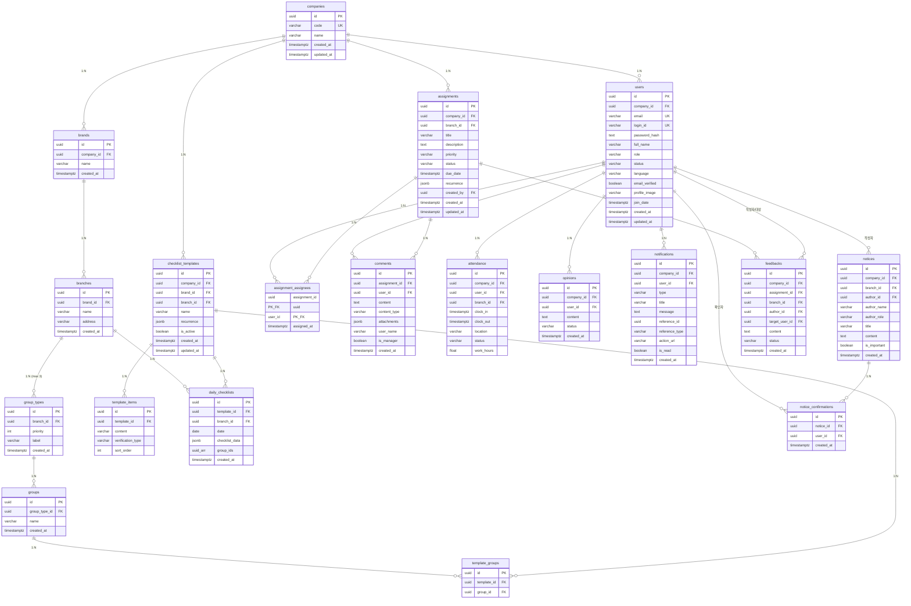

# Task Server DB 명세서 v2

> Supabase (PostgreSQL) 기반 업무 관리 시스템 데이터베이스 스키마 명세 (개편)

**작성일**: 2026-02-13
**데이터베이스**: Supabase (PostgreSQL)
**테이블 수**: 20개 (v1: 16개 → v2: 20개, 구조 전면 개편)

---

## 목차

1. [v1 → v2 변경 요약](#1-v1--v2-변경-요약)
2. [ER 다이어그램](#2-er-다이어그램)
3. [도메인별 테이블 명세](#3-도메인별-테이블-명세)
   - [3.1 조직 도메인](#31-조직-도메인-organization)
   - [3.2 사용자 도메인](#32-사용자-도메인-user)
   - [3.3 체크리스트 도메인](#33-체크리스트-도메인-checklist)
   - [3.4 할당 업무 도메인](#34-할당-업무-도메인-assignment)
   - [3.5 운영 도메인](#35-운영-도메인-operations)
4. [Enum 정의](#4-enum-정의)
5. [테이블 관계 요약](#5-테이블-관계-요약)
6. [API 변경점](#6-api-변경점)
7. [마이그레이션 가이드](#7-마이그레이션-가이드)

---

## 1. v1 → v2 변경 요약

### 1.1 핵심 변경사항

| # | 변경 내용 | 영향 |
|---|----------|------|
| 1 | `companies` 테이블 신설 (B2B, 최상위 조직) | 조직 계층 전면 재편 |
| 2 | `groups` → `group_types` + `groups` 분리 (유형별 최대 3개 카테고리) | 유연한 조직 구조 |
| 3 | `users`에서 `branch_id`, `group_id` 제거 → `company_id` 추가 | 사용자 소속 변경 |
| 4 | 기본 언어 `ko` → `en` (미국 우선) | 신규 사용자 기본값 |
| 5 | `tasks` 테이블 → `assignments` + `daily_checklists`로 분리 | 업무 시스템 전면 개편 |
| 6 | `assigned_to` 단일 → `assignment_assignees` N:M 테이블 | 다중 담당자 지원 |
| 7 | 주기(recurrence) 설정 지원 (daily, weekly, interval 등) | 템플릿 + 할당 업무 |
| 8 | `daily_checklists` JSONB 저장 (템플릿 스냅샷) | 데이터 효율화 |
| 9 | `comments` → `assignment_id` FK로 변경, 멀티미디어 지원 | 댓글 시스템 개편 |
| 10 | `checklist_logs` 테이블 제거 (파일 로그로 대체) | 테이블 축소 |
| 11 | `attendance.clock_in` NULLABLE | 미출근 상태 지원 |
| 12 | `notifications.action_url` 추가 | 딥링크 지원 |
| 13 | `notices`에 `author_name`, `author_role` 추가 | 탈퇴 회원 대비 |
| 14 | `feedbacks`에 `assignment_id`, `branch_id`, `author_id` 추가 | 업무 컨텍스트 |
| 15 | `users`에 `password_hash`, `email_verified` 추가 | 자체 인증 (Supabase Auth 탈피) |
| 16 | `email_verification_codes` 테이블 신설 (6자리 OTP) | 이메일 인증 코드 관리 |

### 1.2 테이블 변경 매핑

| v1 테이블 | v2 테이블 | 변경 |
|-----------|-----------|------|
| - | `companies` | **신설** |
| `brands` | `brands` | `company_id` FK 추가 |
| `branches` | `branches` | 유지 |
| `groups` | `group_types` + `groups` | **분리 재설계** |
| `users` | `users` | `company_id` 추가, `branch_id`/`group_id` 제거 |
| `tasks` | - | **삭제** (assignments + daily_checklists로 분리) |
| `checklist_items` | - | **삭제** (template_items로 통합) |
| `checklist_logs` | - | **삭제** (파일 로그로 대체) |
| `checklist_templates` | `checklist_templates` | **재설계** (recurrence, 조직 스코프) |
| `checklist_template_items` | `template_items` | **이름 변경** |
| - | `template_groups` | **신설** (템플릿-그룹 조합) |
| - | `daily_checklists` | **신설** (JSONB 일일 체크리스트) |
| - | `assignments` | **신설** (할당 업무) |
| - | `assignment_assignees` | **신설** (다중 담당자) |
| `comments` | `comments` | `task_id` → `assignment_id`, 멀티미디어 |
| `attendance` | `attendance` | `clock_in` nullable, `company_id` 추가 |
| `opinions` | `opinions` | `company_id` 추가 |
| `notifications` | `notifications` | `action_url`, `company_id` 추가 |
| `notices` | `notices` | `author_name/role`, `company_id` 추가 |
| `notice_confirmations` | `notice_confirmations` | 유지 |
| `feedbacks` | `feedbacks` | `assignment_id`, `author_id`, `branch_id` 추가 |

### 1.3 도메인 구성 (v2)

| 도메인 | 테이블 수 | 테이블 |
|--------|-----------|--------|
| 조직 (Organization) | 5 | companies, brands, branches, group_types, groups |
| 사용자 (User) | 2 | users, email_verification_codes |
| 체크리스트 (Checklist) | 4 | checklist_templates, template_items, template_groups, daily_checklists |
| 할당 업무 (Assignment) | 3 | assignments, assignment_assignees, comments |
| 운영 (Operations) | 6 | attendance, opinions, notifications, notices, notice_confirmations, feedbacks |
| **합계** | **20** | |

---

## 2. ER 다이어그램



---

## 3. 도메인별 테이블 명세

### 3.1 조직 도메인 (Organization)

#### 3.1.1 `companies` - 회사 (NEW)

> B2B 지원을 위한 최상위 조직 단위. 한 대표/회사가 여러 브랜드를 운영할 수 있음

| 컬럼명 | 타입 | NULL 허용 | 기본값 | 설명 |
|---------|------|:---------:|--------|------|
| `id` | `uuid` | NO | `gen_random_uuid()` | 회사 고유 ID (PK) |
| `code` | `varchar(20)` | NO | - | 회사 고유 코드 (e.g., "ABC", "STAR01") |
| `name` | `varchar` | NO | - | 회사명 |
| `created_at` | `timestamptz` | NO | `now()` | 생성일시 |
| `updated_at` | `timestamptz` | NO | `now()` | 수정일시 |

**제약조건**:
- PK: `id`
- UNIQUE: `code` (회사 코드 중복 불가)

**설계 근거**: B2B SaaS에서 멀티테넌시의 기본 단위. `code`는 회원가입 시 회사 식별, URL 구성 등에 활용

---

#### 3.1.2 `brands` - 브랜드 (CHANGED)

> 회사 소속 프랜차이즈 브랜드

| 컬럼명 | 타입 | NULL 허용 | 기본값 | 설명 |
|---------|------|:---------:|--------|------|
| `id` | `uuid` | NO | `gen_random_uuid()` | 브랜드 고유 ID (PK) |
| `company_id` | `uuid` | NO | - | 소속 회사 ID (FK → companies.id) |
| `name` | `varchar` | NO | - | 브랜드명 |
| `created_at` | `timestamptz` | NO | `now()` | 생성일시 |

**제약조건**:
- PK: `id`
- FK: `company_id` → `companies(id)` ON DELETE CASCADE
- UNIQUE: `(company_id, name)` (같은 회사 내 브랜드명 중복 불가)

**인덱스**:
- `idx_brands_company_id` ON `company_id`

**v1 → v2 변경**: `company_id` FK 추가 (기존 최상위 → 회사 소속)

---

#### 3.1.3 `branches` - 지점

> 브랜드 소속 지점(매장)

| 컬럼명 | 타입 | NULL 허용 | 기본값 | 설명 |
|---------|------|:---------:|--------|------|
| `id` | `uuid` | NO | `gen_random_uuid()` | 지점 고유 ID (PK) |
| `brand_id` | `uuid` | NO | - | 소속 브랜드 ID (FK → brands.id) |
| `name` | `varchar` | NO | - | 지점명 |
| `address` | `varchar` | YES | `NULL` | 지점 주소 |
| `created_at` | `timestamptz` | NO | `now()` | 생성일시 |

**제약조건**:
- PK: `id`
- FK: `brand_id` → `brands(id)` ON DELETE CASCADE

**인덱스**:
- `idx_branches_brand_id` ON `brand_id`

---

#### 3.1.4 `group_types` - 그룹 유형 (NEW)

> 지점별 그룹 카테고리 정의. 최대 3개까지 생성 가능
> e.g., priority=1 label="time"(오픈조/마감조), priority=2 label="part"(홀/주방)

| 컬럼명 | 타입 | NULL 허용 | 기본값 | 설명 |
|---------|------|:---------:|--------|------|
| `id` | `uuid` | NO | `gen_random_uuid()` | 그룹 유형 고유 ID (PK) |
| `branch_id` | `uuid` | NO | - | 소속 지점 ID (FK → branches.id) |
| `priority` | `integer` | NO | - | 우선순위/순서 (1~3) |
| `label` | `varchar(50)` | NO | - | 유형명 (e.g., "time", "part", "role") |
| `created_at` | `timestamptz` | NO | `now()` | 생성일시 |

**제약조건**:
- PK: `id`
- FK: `branch_id` → `branches(id)` ON DELETE CASCADE
- UNIQUE: `(branch_id, priority)` (같은 지점에서 priority 중복 불가)
- CHECK: `priority BETWEEN 1 AND 3`

**인덱스**:
- `idx_group_types_branch_id` ON `branch_id`

**설계 근거**: 지점마다 조/파트 구조가 다르므로 유연한 카테고리 시스템 필요. priority로 조직도/체크리스트 UI에서 정렬 기준 제공

---

#### 3.1.5 `groups` - 그룹 (CHANGED)

> 그룹 유형 내 개별 그룹 항목
> e.g., "time" 유형 아래 "오픈조", "마감조"

| 컬럼명 | 타입 | NULL 허용 | 기본값 | 설명 |
|---------|------|:---------:|--------|------|
| `id` | `uuid` | NO | `gen_random_uuid()` | 그룹 고유 ID (PK) |
| `group_type_id` | `uuid` | NO | - | 소속 그룹 유형 ID (FK → group_types.id) |
| `name` | `varchar` | NO | - | 그룹명 (e.g., "오픈조", "홀") |
| `created_at` | `timestamptz` | NO | `now()` | 생성일시 |

**제약조건**:
- PK: `id`
- FK: `group_type_id` → `group_types(id)` ON DELETE CASCADE
- UNIQUE: `(group_type_id, name)` (같은 유형 내 이름 중복 불가)

**인덱스**:
- `idx_groups_group_type_id` ON `group_type_id`

**v1 → v2 변경**: `branch_id` → `group_type_id`로 FK 변경. 그룹이 유형(카테고리) 소속으로 변경

**조직 계층 예시**:
```
ABC회사 (company)
  └── 스타벅스 (brand)
        └── 강남점 (branch)
              ├── [time] priority=1  (group_type)
              │     ├── 오픈조     (group)
              │     └── 마감조     (group)
              └── [part] priority=2  (group_type)
                    ├── 홀         (group)
                    └── 주방       (group)
```

체크리스트 조합 예시: **오픈조 + 홀** = 아침 홀 체크리스트

---

### 3.2 사용자 도메인 (User)

#### 3.2.1 `users` - 사용자 프로필 (CHANGED)

> 자체 인증 시스템 (Custom JWT + bcrypt). Supabase Auth 미사용. 사용자는 **회사 소속**이며, 회사 내 어느 지점/그룹에서든 근무 가능

| 컬럼명 | 타입 | NULL 허용 | 기본값 | 설명 |
|---------|------|:---------:|--------|------|
| `id` | `uuid` | NO | `gen_random_uuid()` | 사용자 고유 ID (PK) |
| `company_id` | `uuid` | NO | - | 소속 회사 ID (FK → companies.id) |
| `email` | `varchar` | NO | - | 이메일 (SMTP 인증/알림용) |
| `login_id` | `varchar` | NO | - | 로그인 ID (로그인용) |
| `password_hash` | `text` | NO | - | bcrypt 해시 비밀번호 |
| `full_name` | `varchar` | NO | - | 사용자 이름 |
| `role` | `varchar` | NO | `'staff'` | 역할 (staff/manager/admin) |
| `status` | `varchar` | NO | `'pending'` | 계정 상태 (pending/active/inactive) |
| `language` | `varchar` | NO | `'en'` | 언어 설정 |
| `email_verified` | `boolean` | NO | `false` | 이메일 인증 완료 여부 |
| `profile_image` | `varchar` | YES | `NULL` | 프로필 이미지 URL |
| `join_date` | `timestamptz` | YES | `NULL` | 입사일 |
| `created_at` | `timestamptz` | NO | `now()` | 생성일시 |
| `updated_at` | `timestamptz` | NO | `now()` | 수정일시 |

**제약조건**:
- PK: `id`
- FK: `company_id` → `companies(id)` ON DELETE CASCADE
- UNIQUE: `email`
- UNIQUE: `login_id`
- CHECK: `role` IN ('staff', 'manager', 'admin')
- CHECK: `status` IN ('pending', 'active', 'inactive')

**인덱스**:
- `idx_users_company_id` ON `company_id`
- `idx_users_login_id` ON `login_id`
- `idx_users_role` ON `role`
- `idx_users_status` ON `status`

**v1 → v2 변경**:
- `company_id` 추가 (NOT NULL)
- `password_hash` 추가 (bcrypt, NOT NULL) — Supabase Auth 대신 자체 비밀번호 관리
- `email_verified` 추가 (Google SMTP 기반 이메일 인증)
- `branch_id` 제거 (사용자는 특정 지점에 고정되지 않음)
- `group_id` 제거 (사용자는 특정 그룹에 고정되지 않음)
- `language` 기본값 `'ko'` → `'en'`
- `auth.users` FK 제거 (Supabase Auth 미사용, 자체 UUID 생성)

---

#### 3.2.2 `email_verification_codes` - 이메일 인증 코드 (NEW)

> 6자리 OTP 코드 기반 이메일 인증. 회원가입 시 자동 발송, 10분 유효

| 컬럼명 | 타입 | NULL 허용 | 기본값 | 설명 |
|---------|------|:---------:|--------|------|
| `id` | `uuid` | NO | `gen_random_uuid()` | 코드 고유 ID (PK) |
| `user_id` | `uuid` | NO | - | 사용자 ID (FK → users.id) |
| `email` | `varchar(255)` | NO | - | 인증 대상 이메일 |
| `code` | `varchar(6)` | NO | - | 6자리 숫자 OTP 코드 |
| `expires_at` | `timestamptz` | NO | - | 만료 시각 |
| `used` | `boolean` | NO | `false` | 사용 여부 (1회용) |
| `created_at` | `timestamptz` | NO | `now()` | 생성일시 |

**제약조건**:
- PK: `id`
- FK: `user_id` → `users(id)` ON DELETE CASCADE

**인덱스**:
- `idx_verification_codes_email_active` ON `(email, used, expires_at DESC)`

**특이사항**:
- 코드 발송 시 이전 미사용 코드는 `used=true`로 무효화
- 시간당 최대 5회 발송 제한 (rate limiting)
- 기본 유효시간: 10분 (`EMAIL_VERIFY_CODE_EXPIRE_MINUTES`)

---

### 3.3 체크리스트 도메인 (Checklist)

#### 3.3.1 `checklist_templates` - 체크리스트 템플릿 (REDESIGNED)

> 데일리 체크리스트의 원본 템플릿. 조직 계층 스코프 + 주기 설정 지원

| 컬럼명 | 타입 | NULL 허용 | 기본값 | 설명 |
|---------|------|:---------:|--------|------|
| `id` | `uuid` | NO | `gen_random_uuid()` | 템플릿 고유 ID (PK) |
| `company_id` | `uuid` | NO | - | 소속 회사 ID (FK → companies.id) |
| `brand_id` | `uuid` | YES | `NULL` | 브랜드 스코프 (FK → brands.id) |
| `branch_id` | `uuid` | YES | `NULL` | 지점 스코프 (FK → branches.id) |
| `name` | `varchar` | NO | - | 템플릿명 |
| `recurrence` | `jsonb` | NO | `'{"type":"daily"}'` | 주기 설정 |
| `is_active` | `boolean` | NO | `true` | 활성화 여부 |
| `created_at` | `timestamptz` | NO | `now()` | 생성일시 |
| `updated_at` | `timestamptz` | NO | `now()` | 수정일시 |

**제약조건**:
- PK: `id`
- FK: `company_id` → `companies(id)` ON DELETE CASCADE
- FK: `brand_id` → `brands(id)` ON DELETE SET NULL
- FK: `branch_id` → `branches(id)` ON DELETE SET NULL

**인덱스**:
- `idx_templates_company_id` ON `company_id`
- `idx_templates_branch_id` ON `branch_id`
- `idx_templates_is_active` ON `is_active`

**`recurrence` JSONB 형식**:

```jsonc
// 매일
{"type": "daily"}

// 매주 월/수/금
{"type": "weekly", "days": [1, 3, 5]}

// 주말만
{"type": "weekend"}

// 평일만
{"type": "weekday"}

// 3일마다
{"type": "interval", "every": 3}
```

---

#### 3.3.2 `template_items` - 템플릿 항목 (RENAMED)

> 체크리스트 템플릿의 개별 체크 항목

| 컬럼명 | 타입 | NULL 허용 | 기본값 | 설명 |
|---------|------|:---------:|--------|------|
| `id` | `uuid` | NO | `gen_random_uuid()` | 항목 고유 ID (PK) |
| `template_id` | `uuid` | NO | - | 템플릿 ID (FK → checklist_templates.id) |
| `content` | `varchar` | NO | - | 체크 항목 내용 |
| `verification_type` | `varchar` | NO | `'none'` | 검증 유형 (none/photo/signature) |
| `sort_order` | `integer` | NO | `0` | 정렬 순서 |

**제약조건**:
- PK: `id`
- FK: `template_id` → `checklist_templates(id)` ON DELETE CASCADE
- CHECK: `verification_type` IN ('none', 'photo', 'signature')

**인덱스**:
- `idx_template_items_template_id` ON `template_id`

**v1 → v2 변경**: `checklist_template_items` → `template_items`로 이름 변경

---

#### 3.3.3 `template_groups` - 템플릿 그룹 매핑 (NEW)

> 템플릿과 그룹의 조합을 정의. "오픈조 + 홀" 같은 그룹 조합별 체크리스트 생성 가능

| 컬럼명 | 타입 | NULL 허용 | 기본값 | 설명 |
|---------|------|:---------:|--------|------|
| `id` | `uuid` | NO | `gen_random_uuid()` | 매핑 고유 ID (PK) |
| `template_id` | `uuid` | NO | - | 템플릿 ID (FK → checklist_templates.id) |
| `group_id` | `uuid` | NO | - | 그룹 ID (FK → groups.id) |

**제약조건**:
- PK: `id`
- FK: `template_id` → `checklist_templates(id)` ON DELETE CASCADE
- FK: `group_id` → `groups(id)` ON DELETE CASCADE
- UNIQUE: `(template_id, group_id)`

**인덱스**:
- `idx_template_groups_template_id` ON `template_id`
- `idx_template_groups_group_id` ON `group_id`

**사용 예시**:
```
템플릿 "아침 홀 청소"
  → template_groups: [{group: 오픈조}, {group: 홀}]
  = "time:오픈조 + part:홀" 조합의 체크리스트
```

---

#### 3.3.4 `daily_checklists` - 일일 체크리스트 (NEW)

> 템플릿을 JSONB로 스냅샷하여 하루 1 row로 저장. 매일 새 체크리스트 생성 시 row 낭비 방지

| 컬럼명 | 타입 | NULL 허용 | 기본값 | 설명 |
|---------|------|:---------:|--------|------|
| `id` | `uuid` | NO | `gen_random_uuid()` | 체크리스트 고유 ID (PK) |
| `template_id` | `uuid` | NO | - | 원본 템플릿 ID (FK → checklist_templates.id) |
| `branch_id` | `uuid` | NO | - | 지점 ID (FK → branches.id) |
| `date` | `date` | NO | - | 해당 날짜 |
| `checklist_data` | `jsonb` | NO | - | 템플릿 항목 스냅샷 (아래 형식 참조) |
| `group_ids` | `uuid[]` | YES | `NULL` | 해당 그룹 조합 (PostgreSQL array) |
| `created_at` | `timestamptz` | NO | `now()` | 생성일시 |

**제약조건**:
- PK: `id`
- FK: `template_id` → `checklist_templates(id)` ON DELETE RESTRICT
- FK: `branch_id` → `branches(id)` ON DELETE CASCADE
- UNIQUE: `(template_id, branch_id, date)` (동일 템플릿+지점+날짜 중복 방지)

**인덱스**:
- `idx_daily_checklists_branch_date` ON `(branch_id, date)`
- `idx_daily_checklists_template_id` ON `template_id`
- `idx_daily_checklists_date` ON `date`

**`checklist_data` JSONB 형식**:

```jsonc
[
  {
    "item_id": "uuid-of-template-item",
    "content": "테이블 정리",
    "verification_type": "photo",
    "is_completed": false,
    "completed_by": null,       // user_id
    "completed_at": null,       // timestamp
    "verification_data": null   // 사진 URL 등
  },
  {
    "item_id": "uuid-of-template-item-2",
    "content": "바닥 청소",
    "verification_type": "none",
    "is_completed": true,
    "completed_by": "user-uuid",
    "completed_at": "2026-02-13T09:30:00Z",
    "verification_data": null
  }
]
```

---

### 3.4 할당 업무 도메인 (Assignment)

#### 3.4.1 `assignments` - 할당 업무 (NEW)

> 데일리 체크리스트와 분리된 할당 업무. 다양한 정보와 코멘트 지원

| 컬럼명 | 타입 | NULL 허용 | 기본값 | 설명 |
|---------|------|:---------:|--------|------|
| `id` | `uuid` | NO | `gen_random_uuid()` | 업무 고유 ID (PK) |
| `company_id` | `uuid` | NO | - | 회사 ID (FK → companies.id) |
| `branch_id` | `uuid` | YES | `NULL` | 지점 ID (FK → branches.id) |
| `title` | `varchar` | NO | - | 업무 제목 |
| `description` | `text` | YES | `NULL` | 업무 상세 설명 |
| `priority` | `varchar` | NO | `'normal'` | 우선순위 (urgent/normal/low) |
| `status` | `varchar` | NO | `'todo'` | 진행 상태 (todo/in_progress/done) |
| `due_date` | `timestamptz` | YES | `NULL` | 마감 기한 |
| `recurrence` | `jsonb` | YES | `NULL` | 반복 주기 (NULL=일회성) |
| `created_by` | `uuid` | NO | - | 생성자 ID (FK → users.id) |
| `created_at` | `timestamptz` | NO | `now()` | 생성일시 |
| `updated_at` | `timestamptz` | NO | `now()` | 수정일시 |

**제약조건**:
- PK: `id`
- FK: `company_id` → `companies(id)` ON DELETE CASCADE
- FK: `branch_id` → `branches(id)` ON DELETE SET NULL
- FK: `created_by` → `users(id)` ON DELETE SET NULL
- CHECK: `priority` IN ('urgent', 'normal', 'low')
- CHECK: `status` IN ('todo', 'in_progress', 'done')

**인덱스**:
- `idx_assignments_company_id` ON `company_id`
- `idx_assignments_branch_id` ON `branch_id`
- `idx_assignments_status` ON `status`
- `idx_assignments_due_date` ON `due_date`
- `idx_assignments_created_by` ON `created_by`

---

#### 3.4.2 `assignment_assignees` - 할당 담당자 (NEW)

> 하나의 업무에 여러 담당자 지정 가능 (N:M)

| 컬럼명 | 타입 | NULL 허용 | 기본값 | 설명 |
|---------|------|:---------:|--------|------|
| `assignment_id` | `uuid` | NO | - | 업무 ID (FK → assignments.id) |
| `user_id` | `uuid` | NO | - | 담당자 ID (FK → users.id) |
| `assigned_at` | `timestamptz` | NO | `now()` | 할당일시 |

**제약조건**:
- PK: `(assignment_id, user_id)` (복합 PK)
- FK: `assignment_id` → `assignments(id)` ON DELETE CASCADE
- FK: `user_id` → `users(id)` ON DELETE CASCADE

**인덱스**:
- `idx_assignees_user_id` ON `user_id`

---

#### 3.4.3 `comments` - 댓글 (CHANGED)

> 할당 업무에 대한 댓글. 텍스트, 이미지, 영상 등 다양한 형식 지원

| 컬럼명 | 타입 | NULL 허용 | 기본값 | 설명 |
|---------|------|:---------:|--------|------|
| `id` | `uuid` | NO | `gen_random_uuid()` | 댓글 고유 ID (PK) |
| `assignment_id` | `uuid` | NO | - | 업무 ID (FK → assignments.id) |
| `user_id` | `uuid` | NO | - | 작성자 ID (FK → users.id) |
| `content` | `text` | YES | `NULL` | 텍스트 내용 |
| `content_type` | `varchar` | NO | `'text'` | 콘텐츠 유형 (text/image/video/file) |
| `attachments` | `jsonb` | YES | `NULL` | 첨부파일 목록 |
| `user_name` | `varchar` | YES | `NULL` | 작성자 이름 (비정규화) |
| `is_manager` | `boolean` | NO | `false` | 관리자 여부 |
| `created_at` | `timestamptz` | NO | `now()` | 생성일시 |

**제약조건**:
- PK: `id`
- FK: `assignment_id` → `assignments(id)` ON DELETE CASCADE
- FK: `user_id` → `users(id)` ON DELETE CASCADE
- CHECK: `content_type` IN ('text', 'image', 'video', 'file')

**인덱스**:
- `idx_comments_assignment_id` ON `assignment_id`
- `idx_comments_created_at` ON `created_at`

**`attachments` JSONB 형식**:
```jsonc
[
  {"type": "image", "url": "/storage/img123.jpg", "name": "photo.jpg", "size": 204800},
  {"type": "video", "url": "/storage/vid456.mp4", "name": "video.mp4", "size": 10485760}
]
```

**v1 → v2 변경**:
- `task_id` → `assignment_id` 변경
- `content_type`, `attachments` 추가 (멀티미디어 지원)

---

### 3.5 운영 도메인 (Operations)

#### 3.5.1 `attendance` - 출퇴근 기록 (CHANGED)

> 직원 출퇴근 및 근무시간 기록. `clock_in` NULLABLE (미출근 상태)

| 컬럼명 | 타입 | NULL 허용 | 기본값 | 설명 |
|---------|------|:---------:|--------|------|
| `id` | `uuid` | NO | `gen_random_uuid()` | 기록 고유 ID (PK) |
| `company_id` | `uuid` | NO | - | 회사 ID (FK → companies.id) |
| `user_id` | `uuid` | NO | - | 사용자 ID (FK → users.id) |
| `branch_id` | `uuid` | YES | `NULL` | 출근 지점 ID (FK → branches.id) |
| `clock_in` | `timestamptz` | **YES** | `NULL` | 출근 시각 (미출근 시 NULL) |
| `clock_out` | `timestamptz` | YES | `NULL` | 퇴근 시각 |
| `location` | `varchar` | YES | `NULL` | 출근 위치 정보 |
| `status` | `varchar` | NO | `'not_started'` | 출퇴근 상태 |
| `work_hours` | `float` | YES | `NULL` | 근무 시간 (시간 단위) |

**제약조건**:
- PK: `id`
- FK: `company_id` → `companies(id)` ON DELETE CASCADE
- FK: `user_id` → `users(id)` ON DELETE CASCADE
- FK: `branch_id` → `branches(id)` ON DELETE SET NULL
- CHECK: `status` IN ('not_started', 'on_duty', 'off_duty', 'completed')

**인덱스**:
- `idx_attendance_company_user` ON `(company_id, user_id)`
- `idx_attendance_clock_in` ON `clock_in`
- `idx_attendance_branch_id` ON `branch_id`

**v1 → v2 변경**:
- `clock_in` NOT NULL → **NULLABLE** (미출근 상태에서는 출근 시간 없음)
- `company_id`, `branch_id` FK 추가

---

#### 3.5.2 `opinions` - 건의사항 (MINOR CHANGE)

> 직원이 제출하는 건의사항/의견

| 컬럼명 | 타입 | NULL 허용 | 기본값 | 설명 |
|---------|------|:---------:|--------|------|
| `id` | `uuid` | NO | `gen_random_uuid()` | 건의 고유 ID (PK) |
| `company_id` | `uuid` | NO | - | 회사 ID (FK → companies.id) |
| `user_id` | `uuid` | NO | - | 작성자 ID (FK → users.id) |
| `content` | `text` | NO | - | 건의 내용 |
| `status` | `varchar` | NO | `'submitted'` | 처리 상태 |
| `created_at` | `timestamptz` | NO | `now()` | 생성일시 |

**제약조건**:
- PK: `id`
- FK: `company_id` → `companies(id)` ON DELETE CASCADE
- FK: `user_id` → `users(id)` ON DELETE CASCADE
- CHECK: `status` IN ('submitted', 'reviewed', 'resolved')

**인덱스**:
- `idx_opinions_company_id` ON `company_id`
- `idx_opinions_user_id` ON `user_id`
- `idx_opinions_status` ON `status`

**v1 → v2 변경**: `company_id` FK 추가

---

#### 3.5.3 `notifications` - 알림 (ENHANCED)

> 사용자별 알림. 딥링크를 통한 상세페이지/관련 리소스 연결 지원

| 컬럼명 | 타입 | NULL 허용 | 기본값 | 설명 |
|---------|------|:---------:|--------|------|
| `id` | `uuid` | NO | `gen_random_uuid()` | 알림 고유 ID (PK) |
| `company_id` | `uuid` | NO | - | 회사 ID (FK → companies.id) |
| `user_id` | `uuid` | NO | - | 수신자 ID (FK → users.id) |
| `type` | `varchar` | NO | - | 알림 유형 |
| `title` | `varchar` | NO | - | 알림 제목 |
| `message` | `text` | NO | - | 알림 내용 |
| `reference_id` | `uuid` | YES | `NULL` | 참조 대상 ID |
| `reference_type` | `varchar` | YES | `NULL` | 참조 대상 유형 (assignment, notice 등) |
| `action_url` | `varchar` | YES | `NULL` | 딥링크 URL (e.g., "/assignments/123") |
| `is_read` | `boolean` | NO | `false` | 읽음 여부 |
| `created_at` | `timestamptz` | NO | `now()` | 생성일시 |

**제약조건**:
- PK: `id`
- FK: `company_id` → `companies(id)` ON DELETE CASCADE
- FK: `user_id` → `users(id)` ON DELETE CASCADE
- CHECK: `type` IN ('task_assigned', 'task_updated', 'notice', 'feedback', 'comment', 'system')

**인덱스**:
- `idx_notifications_company_user` ON `(company_id, user_id)`
- `idx_notifications_unread` ON `(user_id, is_read)` WHERE `is_read = false`
- `idx_notifications_created_at` ON `created_at`

**v1 → v2 변경**: `action_url` 추가 (딥링크), `company_id` FK 추가

---

#### 3.5.4 `notices` - 공지사항 (ENHANCED)

> 관리자 작성 공지. 탈퇴 회원 대비 작성자 정보 비정규화

| 컬럼명 | 타입 | NULL 허용 | 기본값 | 설명 |
|---------|------|:---------:|--------|------|
| `id` | `uuid` | NO | `gen_random_uuid()` | 공지 고유 ID (PK) |
| `company_id` | `uuid` | NO | - | 회사 ID (FK → companies.id) |
| `branch_id` | `uuid` | YES | `NULL` | 지점 ID (NULL=전사 공지) |
| `author_id` | `uuid` | YES | `NULL` | 작성자 ID (FK → users.id) |
| `author_name` | `varchar` | NO | - | 작성자 이름 (비정규화) |
| `author_role` | `varchar` | YES | `NULL` | 작성자 직급 (비정규화) |
| `title` | `varchar` | NO | - | 공지 제목 |
| `content` | `text` | NO | - | 공지 본문 |
| `is_important` | `boolean` | NO | `false` | 중요 공지 여부 |
| `created_at` | `timestamptz` | NO | `now()` | 생성일시 |

**제약조건**:
- PK: `id`
- FK: `company_id` → `companies(id)` ON DELETE CASCADE
- FK: `branch_id` → `branches(id)` ON DELETE SET NULL
- FK: `author_id` → `users(id)` ON DELETE SET NULL

**인덱스**:
- `idx_notices_company_id` ON `company_id`
- `idx_notices_branch_id` ON `branch_id`
- `idx_notices_created_at` ON `created_at`
- `idx_notices_is_important` ON `is_important`

**v1 → v2 변경**: `author_name`, `author_role` 추가 (탈퇴 회원 대비), `company_id`, `branch_id` 추가

---

#### 3.5.5 `notice_confirmations` - 공지 확인 (UNCHANGED)

> 공지사항 읽음 확인 기록

| 컬럼명 | 타입 | NULL 허용 | 기본값 | 설명 |
|---------|------|:---------:|--------|------|
| `id` | `uuid` | NO | `gen_random_uuid()` | 확인 고유 ID (PK) |
| `notice_id` | `uuid` | NO | - | 공지 ID (FK → notices.id) |
| `user_id` | `uuid` | NO | - | 확인자 ID (FK → users.id) |
| `created_at` | `timestamptz` | NO | `now()` | 확인일시 |

**제약조건**:
- PK: `id`
- FK: `notice_id` → `notices(id)` ON DELETE CASCADE
- FK: `user_id` → `users(id)` ON DELETE CASCADE
- UNIQUE: `(notice_id, user_id)`

---

#### 3.5.6 `feedbacks` - 피드백 (ENHANCED)

> 할당 업무에 대한 피드백. 업무 컨텍스트(어느 지점, 어떤 업무) 포함

| 컬럼명 | 타입 | NULL 허용 | 기본값 | 설명 |
|---------|------|:---------:|--------|------|
| `id` | `uuid` | NO | `gen_random_uuid()` | 피드백 고유 ID (PK) |
| `company_id` | `uuid` | NO | - | 회사 ID (FK → companies.id) |
| `assignment_id` | `uuid` | YES | `NULL` | 관련 업무 ID (FK → assignments.id) |
| `branch_id` | `uuid` | YES | `NULL` | 관련 지점 ID (FK → branches.id) |
| `author_id` | `uuid` | NO | - | 피드백 작성자 (FK → users.id) |
| `target_user_id` | `uuid` | YES | `NULL` | 피드백 대상자 (FK → users.id) |
| `content` | `text` | NO | - | 피드백 내용 |
| `status` | `varchar` | YES | `NULL` | 피드백 상태 |
| `created_at` | `timestamptz` | NO | `now()` | 생성일시 |

**제약조건**:
- PK: `id`
- FK: `company_id` → `companies(id)` ON DELETE CASCADE
- FK: `assignment_id` → `assignments(id)` ON DELETE SET NULL
- FK: `branch_id` → `branches(id)` ON DELETE SET NULL
- FK: `author_id` → `users(id)` ON DELETE CASCADE
- FK: `target_user_id` → `users(id)` ON DELETE SET NULL

**인덱스**:
- `idx_feedbacks_company_id` ON `company_id`
- `idx_feedbacks_assignment_id` ON `assignment_id`
- `idx_feedbacks_author_id` ON `author_id`
- `idx_feedbacks_target_user_id` ON `target_user_id`

**v1 → v2 변경**:
- `user_id` → `target_user_id`로 이름 변경 (명확성)
- `author_id` 추가 (피드백 작성자)
- `assignment_id` 추가 (어떤 업무에 대한 피드백인지)
- `branch_id` 추가 (어느 지점의 업무인지)
- `company_id` 추가

---

## 4. Enum 정의

### 4.1 UserRole (사용자 역할)
```
staff   - 일반 직원
manager - 매니저
admin   - 관리자
```

### 4.2 UserStatus (계정 상태)
```
pending  - 승인 대기
active   - 활성
inactive - 비활성
```

### 4.3 Priority (우선순위)
```
urgent - 긴급
normal - 보통
low    - 낮음
```

### 4.4 AssignmentStatus (할당 업무 상태)
```
todo        - 할 일
in_progress - 진행 중
done        - 완료
```

### 4.5 AttendanceStatus (출퇴근 상태)
```
not_started - 미출근
on_duty     - 근무 중
off_duty    - 퇴근
completed   - 근무 완료
```

### 4.6 NotificationType (알림 유형)
```
task_assigned - 업무 할당 알림
task_updated  - 업무 변경 알림
notice        - 공지사항 알림
feedback      - 피드백 알림
comment       - 댓글 알림
system        - 시스템 알림
```

### 4.7 OpinionStatus (건의사항 상태)
```
submitted - 제출됨
reviewed  - 검토됨
resolved  - 해결됨
```

### 4.8 VerificationType (검증 유형)
```
none      - 검증 없음
photo     - 사진 검증
signature - 서명 검증
```

### 4.9 ContentType (댓글 콘텐츠 유형)
```
text  - 텍스트
image - 이미지
video - 영상
file  - 파일
```

### 4.10 RecurrenceType (주기 유형)
```jsonc
daily    - 매일
weekly   - 매주 특정 요일 (days: [1-7])
weekend  - 주말만
weekday  - 평일만
interval - N일마다 (every: N)
```

---

## 5. 테이블 관계 요약

### 5.1 조직 계층 구조 (v2)

```
companies (회사) ← 최상위 (B2B)
  └── brands (브랜드) [1:N]
        └── branches (지점) [1:N]
              └── group_types (그룹 유형, 최대 3개) [1:N]
                    └── groups (그룹 항목) [1:N]
```

### 5.2 사용자 소속

```
companies (회사)
  └── users (사용자) [1:N]
        ├── email_verification_codes (이메일 인증 코드) [1:N]
        ※ 사용자는 회사 소속, 어느 지점/그룹에서든 근무 가능
```

### 5.3 체크리스트 시스템

```
checklist_templates (템플릿)
  ├── template_items (항목) [1:N]
  ├── template_groups (그룹 매핑) [N:M via groups]
  └── daily_checklists (일일 스냅샷) [1:N]
```

### 5.4 할당 업무 시스템

```
assignments (할당 업무)
  ├── assignment_assignees (담당자) [N:M via users]
  ├── comments (댓글) [1:N]
  └── feedbacks (피드백) [1:N]
```

### 5.5 FK 관계 전체 목록

| 소스 테이블 | 소스 컬럼 | 대상 테이블 | 대상 컬럼 | ON DELETE |
|-------------|-----------|-------------|-----------|-----------|
| `brands` | `company_id` | `companies` | `id` | CASCADE |
| `branches` | `brand_id` | `brands` | `id` | CASCADE |
| `group_types` | `branch_id` | `branches` | `id` | CASCADE |
| `groups` | `group_type_id` | `group_types` | `id` | CASCADE |
| `users` | `company_id` | `companies` | `id` | CASCADE |
| `checklist_templates` | `company_id` | `companies` | `id` | CASCADE |
| `checklist_templates` | `brand_id` | `brands` | `id` | SET NULL |
| `checklist_templates` | `branch_id` | `branches` | `id` | SET NULL |
| `template_items` | `template_id` | `checklist_templates` | `id` | CASCADE |
| `template_groups` | `template_id` | `checklist_templates` | `id` | CASCADE |
| `template_groups` | `group_id` | `groups` | `id` | CASCADE |
| `daily_checklists` | `template_id` | `checklist_templates` | `id` | RESTRICT |
| `daily_checklists` | `branch_id` | `branches` | `id` | CASCADE |
| `assignments` | `company_id` | `companies` | `id` | CASCADE |
| `assignments` | `branch_id` | `branches` | `id` | SET NULL |
| `assignments` | `created_by` | `users` | `id` | SET NULL |
| `assignment_assignees` | `assignment_id` | `assignments` | `id` | CASCADE |
| `assignment_assignees` | `user_id` | `users` | `id` | CASCADE |
| `comments` | `assignment_id` | `assignments` | `id` | CASCADE |
| `comments` | `user_id` | `users` | `id` | CASCADE |
| `attendance` | `company_id` | `companies` | `id` | CASCADE |
| `attendance` | `user_id` | `users` | `id` | CASCADE |
| `attendance` | `branch_id` | `branches` | `id` | SET NULL |
| `opinions` | `company_id` | `companies` | `id` | CASCADE |
| `opinions` | `user_id` | `users` | `id` | CASCADE |
| `notifications` | `company_id` | `companies` | `id` | CASCADE |
| `notifications` | `user_id` | `users` | `id` | CASCADE |
| `notices` | `company_id` | `companies` | `id` | CASCADE |
| `notices` | `branch_id` | `branches` | `id` | SET NULL |
| `notices` | `author_id` | `users` | `id` | SET NULL |
| `notice_confirmations` | `notice_id` | `notices` | `id` | CASCADE |
| `notice_confirmations` | `user_id` | `users` | `id` | CASCADE |
| `feedbacks` | `company_id` | `companies` | `id` | CASCADE |
| `feedbacks` | `assignment_id` | `assignments` | `id` | SET NULL |
| `feedbacks` | `branch_id` | `branches` | `id` | SET NULL |
| `feedbacks` | `author_id` | `users` | `id` | CASCADE |
| `feedbacks` | `target_user_id` | `users` | `id` | SET NULL |

---

## 6. API 변경점

### 6.1 인증 API 변경

| 항목 | v1 | v2 | 비고 |
|------|-----|-----|------|
| 인증 방식 | Supabase Auth | **Custom JWT + bcrypt** | Supabase Auth 의존성 제거 |
| 회원가입 파라미터 | `branch_id` | `company_code` | 회사 코드로 가입 |
| 로그인 방식 | 이메일 로그인 | **login_id 로그인** | 이메일은 SMTP 인증/알림용 |
| 토큰 발급 | Supabase JWT | Custom JWT (HS256) | access_token (60min) + refresh_token (7d) |
| 이메일 인증 | Supabase 내장 | **Google SMTP** | 가입 시 비동기 발송, 별도 verify 엔드포인트 |
| 비밀번호 저장 | Supabase Auth | **bcrypt hash → users.password_hash** | DB 직접 관리 |

### 6.2 업무 API 변경

| v1 엔드포인트 | v2 엔드포인트 | 변경 사항 |
|--------------|--------------|-----------|
| `GET /tasks` | `GET /assignments` | 할당 업무 목록 |
| `POST /tasks` | `POST /assignments` | 할당 업무 생성 (다중 담당자) |
| `GET /tasks/{id}` | `GET /assignments/{id}` | 할당 업무 상세 |
| - | `GET /daily-checklists` | 일일 체크리스트 목록 (NEW) |
| - | `POST /daily-checklists/generate` | 템플릿에서 일일 체크리스트 생성 (NEW) |
| - | `PATCH /daily-checklists/{id}/items/{idx}` | 체크리스트 항목 완료 (NEW) |
| `POST /tasks/{id}/comments` | `POST /assignments/{id}/comments` | 댓글 (멀티미디어) |

### 6.3 조직 API 변경

| v1 엔드포인트 | v2 엔드포인트 | 변경 사항 |
|--------------|--------------|-----------|
| - | `POST /companies` | 회사 생성 (NEW) |
| - | `GET /companies/{code}` | 회사 코드로 조회 (NEW) |
| `GET /brands` | `GET /companies/{id}/brands` | 회사 하위 브랜드 |
| - | `CRUD /branches/{id}/group-types` | 그룹 유형 관리 (NEW) |
| - | `CRUD /group-types/{id}/groups` | 그룹 항목 관리 (NEW) |

### 6.4 복합 API (BFF 패턴) 검토

> 화면 구성에 필요한 데이터를 한 번에 제공하는 API

**권장**: 주요 화면별 복합 엔드포인트 제공

```
GET /api/v2/dashboard
→ { attendance, todayChecklists, pendingAssignments, unreadNotifications }

GET /api/v2/branch/{id}/overview
→ { branch, groupTypes, groups, todayChecklists, staffOnDuty }
```

**장점**: 네트워크 라운드트립 감소, 모바일 성능 개선
**단점**: 백엔드 복잡도 증가, 캐싱 어려움
**대안**: GraphQL 도입 시 클라이언트가 필요한 데이터만 요청 가능

---

## 7. 마이그레이션 가이드

### 7.1 마이그레이션 순서 (의존성 기반)

```
Phase 1: 조직 구조
  1. companies 테이블 생성
  2. brands에 company_id 추가
  3. group_types 테이블 생성
  4. groups 재구성 (branch_id → group_type_id)

Phase 2: 사용자 + 자체 인증
  5. users에 company_id 추가
  6. users에 password_hash (text NOT NULL) 추가
  7. users에 email_verified (boolean DEFAULT false) 추가
  8. users에서 branch_id, group_id 제거
  9. users에서 auth.users FK 제거 (Supabase Auth 미사용)
  10. language 기본값 변경
  11. 기존 사용자 password_hash 백필 (Supabase Auth → bcrypt 변환 필요)

Phase 3: 업무 시스템
  8. checklist_templates 재구성
  9. template_items 생성 (from checklist_template_items)
  10. template_groups 생성
  11. daily_checklists 생성
  12. assignments 생성 (from tasks WHERE type='assigned')
  13. assignment_assignees 생성
  14. comments 변경 (task_id → assignment_id)

Phase 4: 운영
  15. attendance 변경 (clock_in nullable)
  16. notifications에 action_url 추가
  17. notices에 author_name/role 추가
  18. feedbacks 재구성

Phase 5: 정리
  19. tasks 테이블 삭제
  20. checklist_items 테이블 삭제
  21. checklist_logs 테이블 삭제
  22. checklist_template_items → template_items 이름 변경
```

### 7.2 데이터 마이그레이션 주의사항

- `tasks` → `assignments` 변환 시 `type='assigned'` 데이터만 이관
- `tasks` → `daily_checklists` 변환 시 `type='daily'` 데이터를 JSONB로 변환
- `assigned_to` 단일 값 → `assignment_assignees` 테이블로 이관
- 기존 `comments.task_id` → 해당 task가 assignment로 변환된 후 `assignment_id`로 매핑
- `notices`의 기존 데이터에 `author_name/role` 백필 필요
